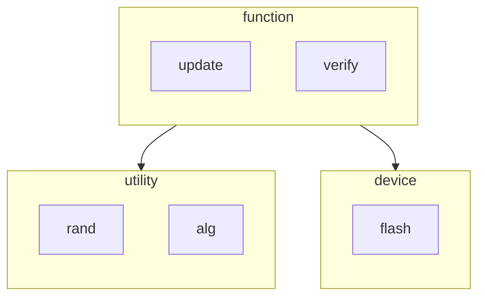
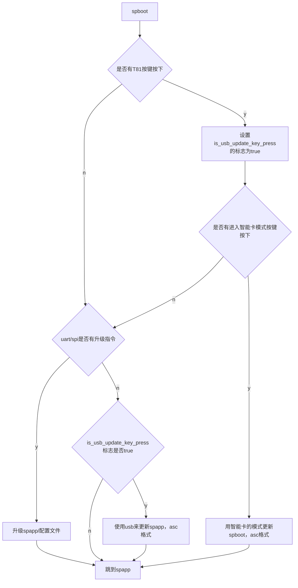
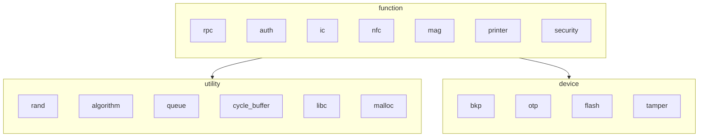
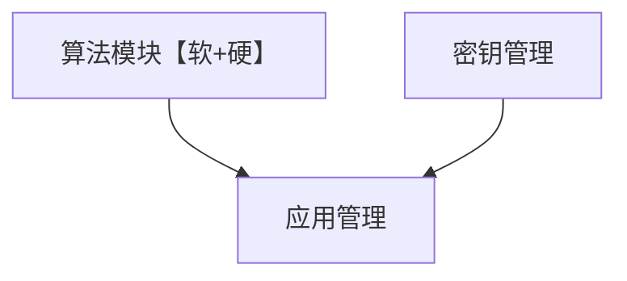
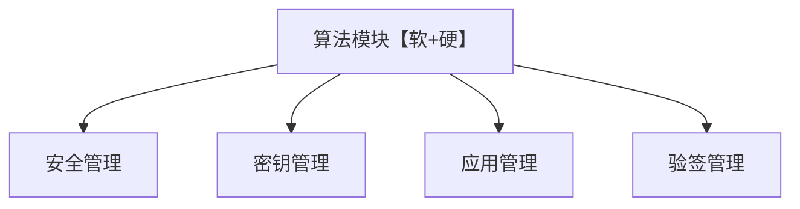
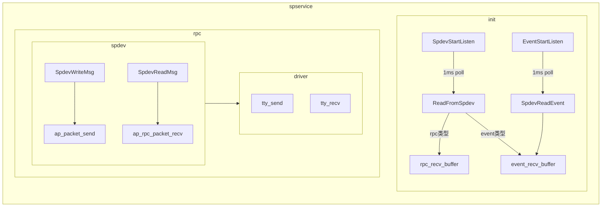
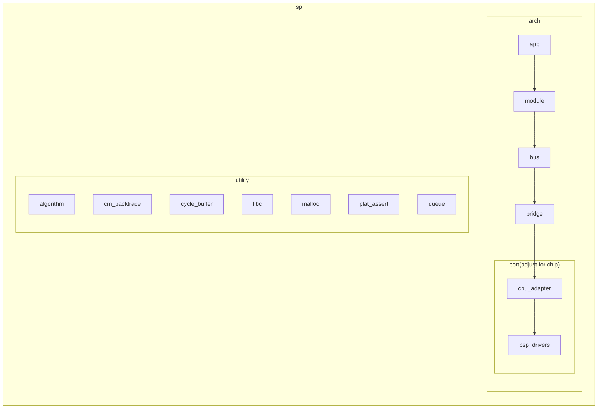
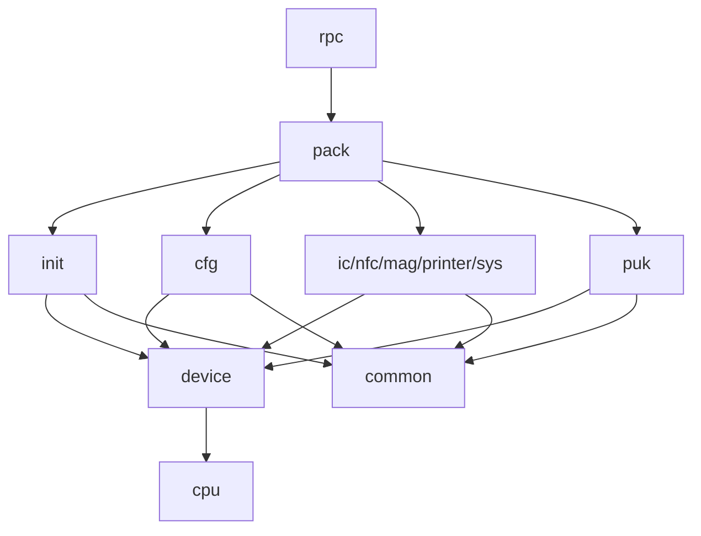

# 代码修改rule:
* 用4个空格代替tab
* 非必要不要用中文，用中文也要用utf-8的格式。
* 保存方式尽量不要用windows的CRLF换行格式，用LF格式即可。
* 不用大小写驼峰方式，既然是linxu下的环境，名字尽量也用linux的风格，用下划线，比如xxx_xxx_xxx的格式，都是小写，只有宏用大写。
* 所有接口返回值没有特殊情况都用int，返回值0为正常，一般来说以负值为异常。
* 自己文件定义的结构体和类型就放在自己的头文件里面，不要汇总到一个总的头文件里面。
* 严禁跨层调用，比如bsp_driver的只给cpu_adapter的用，bus的只能用cpu_adapter.
* 名字不要用那种通用的，因为每次引入第三方代码的时候都会发现很多同名函数，同名文件，甚至同名类型定义。
* 尽量不要使用uchar之类的，因为这些会跟第三方的头文件产生冲突。实在要使用就使用#define 而不是typedef。另外自己使用的就在自己的头文件中定义。
* 地址尽可能用int，31位可以表示2gbyte的大小了。二进制数据指针就尽可能用unsigned char *, 数据指针可以使用char *即可。
* 去掉#include <string.h>， 否则会一直使用c库的memset。


# ap

## high

1. 不断的按按键会干扰rpc通信。测试发现sp发送完毕之后ap收不到。将sp发送改为不中断的方式，设置gpio的优先级比较低似乎都没有效果。关闭uart dma可以正常工作。原理应该是按键产生中断之后会进行扫描，这个时候如果刚好执行了uart_dma_recv_reset里面的 DMA_Cmd(DMA_Channelx, DISABLE);就会导致无法接收ap的数据。所以后面还是要改掉uart_dma_recv_reset的用法，使用链表的方式，在中断里面重新配置dma的缓存。
2. iccisocommond 还没有实现
3. warning
4. 代码格式整理
5. 各驱动的中断优先级：NVIC_SetPriority(ADC_IRQn, THM36X2_INTC_PRIO_HIGHEST);NVIC_EnableIRQ(ADC_IRQn);
6. 需要参考SPIx_DemoReciveTransmitTest-->TMC_SPI_TransmitReceive_DMA(&TMC_SPIx,SPITestBuffer_tx,SPITestBuffer_rx,13,(u32)(&spi_RX_lli[0]),(u32)(&spi_TX_lli[0]));-->DMA_SetChainListAddress(hspi->hdmarx->Instance,hspi->hdmarx->Instance->LLI);的方式增加链表，原理是跟单个dma一样的设置方法，只是多配置链表，然后链表结束之后能产生中断，在中断里面判断当前链表的地址来决定当前数据到了什么地方，此时依然可以通过DMA_GetCurrDataCounter来获取当前的计数位置。


* picc/mag/tp irq 中处理数据--irq中启动0/1us的低优先级timer来处理里面的逻辑。priority：DMA=IC>PICC>IC_DETECT>MAG
* 密钥文件放在ap中，每次要操作的时候将密钥文件发给sp，写密钥的时候需要先传给sp，通过sp使用sek加密之后放到ap中存储下来。
printk/ReadCfgInfo/irq_restore_asm/irq_prio_info_mtk/sys_stop_thm36x2/irq_disable_thm36x2/irq_enable_thm36x2/irq_save_asm/irq_restore_asm改造过
注释set_sys_tick_proc(time_set_authinfo_update_flag);因为s_GetSensorStatus为空导致越界。


## low

* spi通信时候需要优化的函数PackSentOut/SP_SendKeyValToAP/list_mount里面的platform_sendtoap/flash_init/printf_to_ap
* spi_api.c中的锁需要处理。
* sp没有脚指示状态，那么就在boot开机过程中亮灯或者响beep。


# spboot



## funtion
* update：升级spboot/spapp/配置文件。
	* spboot的更新方式目前只支持手动操作，通过特殊的按键进入原厂的智能卡模式进行升级。
	* spapp的更新方式目前支持spi和uart的方式下载，ap端将spapp的固件通过分包的方式下发给spboot，spboot校验通过后替换更新。
	* 配置文件，下载方式同spapp，格式使用yaml格式。
* verify：证书体系功能详细说明【todo】。

## device
flash：存储spboot，spapp，配置文件。

## 启动流程



## 固件签名验签逻辑

* 前提：

  需要公司的rsa公私钥对，私钥严格秘密保存在加密机里，公钥固化在终端固件中。【前期开发没有加密机可以使用开发提供的公私钥对和工具】

* 签名流程：

  固件提交签名服务器，服务器签名就是先算出固件的哈希，将这个哈希用私钥进行加密得到256字节的签名数据。这个签名数据会附着在固件尾巴一并回给请求方。【这个签名数据之外也可以定制公司自定义的一些数据，比如签名类型，签名客户字段等】。

* 验签流程：包括下载验签和运行验签。

  下载验签由ap来控制，ap端可以使用接口进行下载【后期也应该加上adb方式下载】。接口拿到这个bin之后会使用固化的公钥对这个签名数据进行解密得到哈希，固件也会计算这个bin的哈希，两个哈希比对一致就证明数据是完整的。

  运行验签由spboot来控制，spboot启动的时候会检查固件区的镜像是否完整。完整才允许跳转。

  ```mermaid
  flowchart LR

          发送方数据 --哈希--> 发送方原始数据哈希
          发送方原始数据哈希 --私钥--> 发送方签名

          接收方签名 --公钥--> 接收方签名数据哈希
          接收方数据 --哈希--> 接收方原始数据哈希
          接收方签名数据哈希-->比较{"`是否匹配`"} 
          接收方原始数据哈希-->比较{"`是否匹配`"} 
  

  ```

# spapp




## device
bkp存放auth，mmk，调试态信息。
otp存放对次数有限制的场景以及不想被修改的sn场景。


* 对外接口


* 内部使用关系




## rpc
	* mp300使用结构体，每种数据类型就用一种结构体。--如果接口很多，参数不定，这个结构体就无法适合使用。
	* original使用tlv格式来组包解包。

```
ap组包
                 
AddPackParam将干净数据通过push_buf压缩到fifo里面。同时组好SPDEV_PARAM包，这个包指明压缩进去数据的属性。
makePackage将干净数据和元数据都通过push_buf到msgTx(SPDEV_COMM_PACK).
SpdevWriteMsg将msgTx的数据解压成具体的长达，然后通过ap_packet_send发送出去。

sp解包
先找SPDEV_COMM_PACK的头标志，然后把剩余的数据读取出来。
如果读取失败就丢弃，重新从缓冲里面去找起始标记。读到合法的数据就将剩余的读取出来，读取的时候会做1秒的超时。能实现这个机制的愿意是中断会往缓冲里面放数据。要注意的一个地方就是收取数据的时候是根据包的大小来动态申请缓存的。10个参数就会申请10个tlv，这里的tlv只是参数，并没有包含实际的值，实际的值早已经在RecvPack已经预先申请好2k的数据。

```



## structure


* 代码目标：
实现all in one，不同芯片，不同机型，都可以使用同一套代码，条件允许的情况下使用同一个固件。

* 根据文件夹从上往下划分：
app: 主要负责对外的接口。对外的接口通过打包解包的方式进行交互。
module：功能模块，比如ic/printer/nfc等。
utility: 公共的工具集合
bus：虚拟总线，承上启下。module里面各个模块使用的就是这里的虚拟总线。
bridge：桥接层，负责将bus和cpu_adapter进行映射不同的芯片。
cpu_adapter: 根据厂家的bsp_drivers进行总线级别的封装。
bsp_drivers: 厂商bsp的驱动。

* 芯片移植说明：
替换bsp_drivers, 然后基于此完成cpu_adapter的适配。
   
* 应用开发说明：
主要是app和module的开发。


* 代码说明：
device_adapter是对框架的调用，负责机型的判断使用。使用以下的基础设施。
device_base是对这个芯片硬件资源的基本配置。
device_d80在device_base基础上做的overlay，其他device_xxx同理。
chip_thm36x2这个的作用是应付一软多硬。可以同时加载device_d80,device_xxx等多个项目。运行时区分，通过配置文件中读到的机型来选择对应的设备配置。


* sample：
device_adapter：
register_platform_operation--get_platform_op_thm36x2
register_device
--get_device_op(uchar *term_name){遍历d80...}
--get_device_info(int pcb_ver)set_device_info_d80[set_device_info_mtk, hw_res_overlay_d80]


按功能划分模块大致如下：

* function
	* [ ] rpc
	* [ ] nfc
	* [ ] printer
	* [ ] mag
	* [ ] ic-psam
	* [ ] security--3rd, ped,tamper
	* [ ] auth
	* [ ] beep
	* [ ] keypad
	* [ ] input_device
	* [ ] rtc
* utility
  * [ ] rand
  * [ ] queue
  * [ ] algorithm
  * [ ] cycle_buffer
  * [ ] libc
  * [ ] malloc
* bus
	* [ ] encrypt
	* [ ] gpio
	* [ ] irq
	* [ ] log
	* [ ] rand
	* [ ] random
	* [ ] rtc
	* [ ] spi
	* [ ] sys
	* [ ] timer
	* [ ] uart
	* [ ] adc
* [] bridge
* cpu_adapter
	* [ ] encrypt
	* [ ] gpio
	* [ ] irq
	* [ ] log
	* [ ] rand
	* [ ] random
	* [ ] rtc
	* [ ] spi
	* [ ] sys
	* [ ] timer
	* [ ] uart
	* [ ] adc
* [] bsp_drivers


工作开发：应用功能和驱动功能两部分同时进行。

一、驱动部分：
1. 以单独测试的方式完成基本功能
2. 基于代码框架做成对应的一个功能模块。
3. 自测

* 模块开发：
1. 触发
2. 休眠
3. uart的dma功能
4. otp功能
  
* 代码整理：
需要将每个cpu_adapter层的模块进行整理。按照统一的规范，将warning和不合理的地方整理完善。

* 优先级（由上往下）
代码整理（建议每个人分几个模块，尽快完善好，也方便其他的芯片按照统一的风格处理和调用）-->模块开发


二、应用部分：
1. 基于驱动完成的模块功能接口，做进一步的管理功能。
2. 基于这个应用功能完成与ap间的联调。
3. 自测。


三、boot开发：
待定。


summary





登录vpn，使用仓库http://172.16.10.144:3000/wangkai/Np-Pos-Sp.git

# module

## ic

20250109_UL561: 调试T=1 ic卡的国外卡片的用例工具，也是L3的工具，需要安装UL561的工具和用例，同时终端运行的是cup。测试的时候设备卡片插入机器运行cup的交易。


## 休眠


硬件有两个同步脚：
ap_inform_sp:ap输出，sp输入
sp_inform_ap:ap输入，sp输出

20250121：
ap休眠的时候拉低ap_inform_sp脚，sp收到这个500ms低电平，会马上进入休眠状态。方便硬件进行测试
ap唤醒的时候拉高ap_inform_sp脚100ms（目的是等sp醒来并就绪。），sp收到上升沿就会进入唤醒。
sp插卡醒来的时候通过sp_inform_ap脚给出一个上升沿，ap内核醒来做亮屏动作。


增加一个vsp 30秒空闲会让sp休眠的逻辑。
sp就绪的状态下会开始计数sleep_timer
ic_detect + 每次发送数据: 会清除sleep_timer
收到enter sleep或者设备异常都会执行sp的唤醒动作。


20250107:
sp在30秒没有交互，就自动进入休眠，休眠之后会拉低sp_inform_ap引脚,醒来拉高。
ap在每次醒来在kernel会唤醒sp。
vsp会监听sp的enter和exit sleep消息来设置sp的状态，如果为休眠状态，会先唤醒sp


20241019：
sp在30秒没有交互，就自动进入休眠，休眠之后会拉低sp_inform_ap引脚。ap在每次交互前先检查sp_inform_ap，如果为低，就拉低ap_inform_sp让sp醒来。
插卡sp可以通过sp_inform_ap引脚拉高唤醒ap，ap收到唤醒之后，会触发powerkey功能亮屏。


以下是旧逻辑，废弃：
ap的kernel逻辑：
1、suspend：拉高ap_inform_sp引脚。sp会进入休眠，sp这时拉低sp_inform_ap引脚。
2、resume：拉低ap_inform_sp引脚让sp从休眠中唤醒。sp醒来会拉高sp_inform_ap引脚。最好能再起一个线程，不断的检查当前的sp_inform_ap状态，如果为休眠状态，应该能唤醒再次唤醒sp
3、如果上面第2点不实现，resume之后在hal层直接判断sp_inform_ap对应的电平，如果是低电平，那么就拉低ap_inform_sp引脚让sp从休眠中唤醒。sp醒来会拉高sp_inform_ap引脚。不建议这种方式。
4、sp唤醒ap逻辑，sp插卡醒来之后拉高sp_inform_ap引脚。ap应该可以走resume流程，同时触发powerkey功能亮屏。


D60:
ap_inform_sp_pin--SP_RST_N:sp休眠控制脚，sp输入，ap输出，下降沿唤醒sp，高电平让sp进入休眠。
SP:GB_IO3--AP:GPIO_EXT0--对应gpio163

sp_inform_ap_pin--SP_ALARM:SP状态指示，sp输出，ap输入，高为正常工作，低为休眠状态。
SP:GC_IO4--AP:PWM0--对应gpio90


d20:
ap_inform_sp_pin--SP_RST_N:sp休眠控制脚，sp输入，ap输出，下降沿唤醒sp，高电平让sp进入休眠。
SP:GB_IO3--AP:GPIO_EXT0--对应gpio163

sp_inform_ap_pin--SP_ALARM:SP状态指示，sp输出，ap输入，高为正常工作，低为休眠状态。
SP:GC_IO4--AP:BPI_BUS15_ANT2--对应GPIO52


d30m/d50:
ap_inform_sp_pin--AP_INT_SP:
SP:GD_IO11--AP:EINT8--对应gpio8

sp_inform_ap_pin--SP_INT_AP:
SP:GD_IO10--AP:GPIO_EXT0--对应gpio163

## nfc

非接参数解析：
Fm17660GetParamTagValue
nfc_para1 = 000007FF050506000600
nfc_para2 = 005c8a8a8a05E0E0C0C0
nfc_para3 = 

1~4字节【4个】：非接参数的有效个数，000007FF得到的是0x7ff，表示有11个参数有效。
5~10字节【6个】：050506000600
11~20字节【10个】：005c8a8a8a05E0E0C0C0
如果只有nfc_para1和nfc_para2，那么解析出来的参数个数是16个。
如果nfc_para3也存在，那么总参数个数就是26个。

ps：上面的参数有一个问题，明明nfc_para1和nfc_para2总共配置了16个参数，但是参数有效位却是0x7ff，也就是只有11个。


<FM17660-NFC参数-寄存器值.xlsx>

## card

issue:dsp的机器两张B卡放一起的时候识别不到冲突，直接选了一张来进行通信。

method：
* 芯片寄存器：冲突，crc，奇偶校验，无应答。
* 应用层面收到的错误码一般是无卡，多卡，协议错，校验错等。
* ISO14443_3A_Wup--ISO14443_3A_AntiSel【/*select card and get uid*/】--ISO14443_3A_Halt--ISO14443_3A_Req【/*check if other type A card enter into field*/】
* 冲突，无卡等都是根据流程来决定错误码：比如B卡的话/ISO14443_3B_Wup阶段出错就返回RET_RF_DET_ERR_COLL。而A卡是ISO14443_3A_AntiSel/ISO14443_3A_Req，这里的出错是除了响应之外的芯片异常返回。
* 无卡一般是寄存器无应答。
* 两张a卡是报RET_RF_DET_ERR_NO_CARD【芯片没有应答】，两张b卡报RET_RF_DET_ERR_COLL/RET_RF_ERR_PARITY【芯片返回的校验错】


## uart

uart_init:应用层初始化变量
rpc_init/log_init:调用uart_drv进行初始化，中断的方式在串口中断中处理寄存器和缓存的交互。dma的方式会关掉uart中断，dma满的时候会触发rpc_uart_rx_dma_irq的回调，将dma的接收地址恢复到初始位置。


## printer

### 参数：
1行 = 48mm = 48个字节 = 384个像素 --> 1个像素 = 0.125mm
打印电压: 不能超过5.5v（低压打印机）
打印点数：最高不能超过96个点
打印相位：2-2相就是全步，一步可以走半个像素，打印速度快，但是噪音偏大，对能量的需求也大一点，规格书都是以这个为准。1-2相半步，一步可以走1/4个像素，打印速度慢，噪音偏小。
打印速度：2-2下可以到70mm/s。
加热时间和加热电阻：都有公式。


VP_EN_3V3--GINT14:ptr_vdd：给打印机头电源使用。
MOTO_EN_3V3--GPIO:mot_pwr


PRINTER_VDD33_EN	GINT7:给VDD_PRINT 同时会产生VPS,给缺纸检测使用。这个别的项目是常供的。

STB_3V3--GINT13:n_stb0
LAT_3V3--SS2:n_latch
PRINT_SPI_SCK_3V3--SCK2:
PRINT_SPI_MOSI_3V3--MOSI2:
PH1_3V3--SS1:mta
PH2_3V3--SCK1:n_mta
PH3_3V3--MOSI1:mtb
PH4_3V3--MISO1:n_mtb
PSENSOR_3V3--ADC_IN2:纸
TH1--ADC_IN1:温度
SVP--ADC_IN0:电压检测，分压电阻


单个电池3.7v
//d60
两节串联-7.4v直通电池
高压
加热丝=170欧
p = 0.322


//d30m/a50m
两节并联-升压4.8v
低压
加热丝=80欧
p = 0.288

根据功率公式电压的平方除以电阻，低压打印机的p比高压的低，也就是效果肯定比不上，所以速度只能更慢。


xgd：fun_test_printer-->ddi_thmprn_print_point《E:\001_work\001_dspread\003_project\001_d80\000_file\printer\xgd-AP打印》


* 三要素：编码类型+码字+字库
* 编码方式GB18030/GBK/GB2312只是中国使用，big5是繁体使用，会出现同一个码字表示的字符不一样，不适合在跨平台的地方使用，使用使用unicode来为全世界的字符定义唯一的码字，多采用utf-8的方式来定义码字。
* 每个文本存储的信息有两种，分别是编码类型和码字，os通过这两个信息去字库中找到对应位置的信息并提取出来显示。
* 矢量字库用公式来表征内容的轮廓，所以不受分辨率的影响。文件格式一般是TrueType（TTF),与之对应的点阵字库是位图的形式（Bitmap Font）。
* 使用FontForge工具可以制作和修改ttf。字库来源http://wenq.org/ 可以改为https://github.com/lxgw/LxgwWenKai
* 目前支持的是CHARSET_GB2312/CHARSET_GBK/CHARSET_GB18030/CHARSET_BIG5/CHARSET_SHIFT_JIS/CHARSET_KOREAN


202550228-低温测试结果
02-28 13:40:16.039161   766  1231 D VSP:vendor/dspread/proprietary/platform/libprinter/printer.c: [calc_heat_dots-528]temperature = -8, voltage = 3465, heatdots = 12
02-28 13:40:27.686756   766  1231 D VSP:vendor/dspread/proprietary/platform/libprinter/printer.c: [calc_heat_dots-528]temperature = -8, voltage = 3377, heatdots = 12
02-28 13:41:14.612577   766  1231 D VSP:vendor/dspread/proprietary/platform/libprinter/printer.c: [calc_heat_dots-528]temperature = -7, voltage = 3429, heatdots = 12
02-28 13:41:25.647402   766  1231 D VSP:vendor/dspread/proprietary/platform/libprinter/printer.c: [calc_heat_dots-528]temperature = -6, voltage = 3349, heatdots = 12
02-28 13:41:49.164105   766  1231 D VSP:vendor/dspread/proprietary/platform/libprinter/printer.c: [calc_heat_dots-528]temperature = -6, voltage = 3422, heatdots = 12
02-28 13:42:02.200384   766  1231 D VSP:vendor/dspread/proprietary/platform/libprinter/printer.c: [calc_heat_dots-528]temperature = -6, voltage = 3371, heatdots = 12
02-28 13:42:14.104159   766  1231 D VSP:vendor/dspread/proprietary/platform/libprinter/printer.c: [calc_heat_dots-528]temperature = -5, voltage = 3334, heatdots = 12
02-28 13:42:25.129130   766  1231 D VSP:vendor/dspread/proprietary/platform/libprinter/printer.c: [calc_heat_dots-528]temperature = -5, voltage = 3299, heatdots = 12
02-28 13:42:38.267077   766  1231 D VSP:vendor/dspread/proprietary/platform/libprinter/printer.c: [calc_heat_dots-528]temperature = -5, voltage = 3320, heatdots = 12
02-28 13:43:53.829997   766  1231 D VSP:vendor/dspread/proprietary/platform/libprinter/printer.c: [calc_heat_dots-528]temperature = -4, voltage = 3443, heatdots = 24
02-28 13:44:03.784876   766  1231 D VSP:vendor/dspread/proprietary/platform/libprinter/printer.c: [calc_heat_dots-528]temperature = -4, voltage = 3389, heatdots = 24
02-28 13:44:31.308268   766  1231 D VSP:vendor/dspread/proprietary/platform/libprinter/printer.c: [calc_heat_dots-528]temperature = -3, voltage = 3434, heatdots = 24


### ap
* [ ] printer:这块有一个sdk的处理。字库的选择，编码方式的转换（gbk，utf-8等），然后从字库里面提取数据之后按设定的对齐方式填充到点阵里面传输给sp。
* [ ] rpc
* [ ] libft3
* [ ] libprinter
* [ ] lib_sp
* [x] update_sp
* [ ] rpc
* [x] update_cfg


### ttf对比：
* LXGW WenKai / 霞鹜文楷
https://github.com/lxgw/LxgwWenKai
--LXGWWenKaiMono-Bold.ttf字体可以解决字母发虚的问题，但是有18M，原来的文泉驿微米黑就是6M左右。


* 文泉驿
http://wenq.org/wqy2/index.cgi
--这个需要用安装包安装到对应系统之后找到对应的ttf，不能单独下载。


* 思源
https://github.com/adobe-fonts/source-han-sans
--SourceHanSansTC-Bold.otf下载的文件放进去之后打开会崩溃。

other
* 使用Alibaba-PuHuiTi-Regular.otf和思源的source-han-sans-release\OTF\SimplifiedChinese下的都会导致崩溃
* https://www.hmi.gaotongfont.cn/kfgj


* 测试结果

SP_THM36X2_RELEASE_20240522_4b228f5_V1.00.bin:a50m测试结果
4:speed test:text=45.04mm/s
5:speed test:bmp=64.18mm/s
6:speed test:text-only start=51.98mm/s
7:speed test:bmp-only start=65.21mm/s
8:speed test:blank=71.4285mm/s
9:speed test:blank-only start=80.798479mm/s

app_rel5=50mm/s
app_rel6=57369mm/s


# issue

20240918-明文密钥崩溃的问题

猜测原因是明文的时候没有使用初始化话输出长度，随机值如果大于2048就会越界

[60735][PackProcess-469]MainCommand = 0x15, SubCommand = 0x1
[60953][PackSecKeymgrFun-388]iRet = 0
[60977][PackProcess-469]MainCommand = 0x15, SubCommand = 0xe
[60982][PackSecKeymgrFun-388]iRet = 0
[61001][PackProcess-469]MainCommand = 0x15, SubCommand = 0x1
[61183][PackSecKeymgrFun-388]iRet = 0
[61208][PackProcess-469]MainCommand = 0x15, SubCommand = 0xe
[61213][PackSecKeymgrFun-388]iRet = 0
[61232][PackProcess-469]MainCommand = 0x15, SubCommand = 0x1
[61413][PackSecKeymgrFun-388]iRet = 0
[61431][PackProcess-469]MainCommand = 0x15, SubCommand = 0xe
[61436][PackSecKeymgrFun-388]iRet = 0
[61455][PackProcess-469]MainCommand = 0x15, SubCommand = 0x1
[61634][PackSecKeymgrFun-388]iRet = 0
[61646][PackProcess-469]MainCommand = 0x15, SubCommand = 0xe
[61648][PackSecKeymgrFun-388]iRet = 0
[61661][PackProcess-469]MainCommand = 0x15, SubCommand = 0x1
[61874][PackSecKeymgrFun-388]iRet = 0
[61894][PackProcess-469]MainCommand = 0x15, SubCommand = 0xe
[61895][PackSecKeymgrFun-388]iRet = 0
[61911][PackProcess-469]MainCommand = 0x15, SubCommand = 0x1
[62144]splog:
[62146]splog:Firmware name: Project, hardware version: V1.0.0, software version: V0.1.0
[62146]splog:
[62147]splog:[exception crash-706]start = 0x2001fb5c, size = 0x204a4, limit = 0x20040000, current = 0x2003ff18, 0
[62147]splog:
[62149]splog:=================== Registers information ====================[62149]splog:
[62149]splog:  R0 : 2000761c  R1 : 20016d22  R2 : ffffffff  R3 : 00000003[62149]splog:
[62149]splog:  R12: 20008e24  LR : 1002d927  PC : 10033c40  PSR: 01000200[62149]splog:
[62149]splog:==============================================================

arm-none-eabi-addr2line 1002d927 10033c40 -f -e ./bin/*.elf
PackSecKeymgrFun
/home/zhangchengyu/work/ap/br/buildroot-2023.02.3/tx/sp/d80_sp/project_gcc/../code/src/app_layer/pack/pack_security_fun.c:388
freemem
/home/zhangchengyu/work/ap/br/buildroot-2023.02.3/tx/sp/d80_sp/project_gcc/../code/src/utility/malloc/dsp_malloc.c:131


解决commit是
commit e6b803ee21e51a8638f8c6181ead18f65c9434f1 (HEAD -> second_boot_version, origin/second_boot_version)
Author: zhangchengyu <zhangchengyu@mail.dspread.com>
Date:   Wed Sep 18 14:08:32 2024 +0800

    fix 写明文密钥的时候会崩溃的问题，pin输入异常的问题


## 20240606-打印日志导致crash
从pc和lr地址反应出来的出错位置是list和pack的内容，而且是在频繁的打印日志的场景下出现的。
看代码，打印日志用了串口中断，rpc也是用的串口中断（没有使用dma），大家用的优先级都是最高的。
按理说将日志的中断优先级设置低应该能解决问题，但实测并不能解决问题。
--暂时不知道如何解决，只能要求不要打印那么多日志。或者使用阻塞的方式来打印日志。
--复现的方法，打开SECURITY_DEBUG，然后使用PED--load Master key（plain）进行测试。


## 20240524-升级boot失败：

现象：在应用中升级boot，在从备份去拷贝写到实际区的时候，发现很容易出现写进去再读出来不一致。
原因是：在些片内flash的时候irq_save_thm36x2和irq_restore_thm36x2为空，实际是需要通过__asm volatile ("cpsid i" : : : "memory");和__asm volatile ("cpsie i" : : : "memory");保证片内flash的操作不被干扰。
小结：一些诡异并且设计片内资源有关的东西，建议使用内存和中断隔离来保证不被影响。


## 20240517-issue
软重启和软启动命令发给spboot的时候发现经常收不到，原因是因为spboot会的数据报序列号不变，所以ap测这两个接口不判断返回数据数据包。


## 20240425_a50m重启
a50m遇到机器开启来之后，usb拔出之后就会关机，关闭selinux问题不会有，从日志发现，DspDeviceManagerService这个服务一直在重新启动，但是因为权限没有开启，导致一直在重试，拔出usb之后，会发现系统会跟pmic进行交互，但是交互失败，导致系统认为没有电量关机，原因应该是异常的服务不断的重启导致系统别的正常的系统服务都无法正常工作。


## 过滤文件夹失败

原因是filter-out无法递归操作，需要逐个进行过滤

VPATH := $(shell find $(ROOTDIR) -type d)

\# $(info exclude_cpu_name 1: $(exclude_cpu_name))

VPATH := $(filter-out $(ROOTDIR)/src/cpu_adapter/cpu_$(exclude_cpu_name),$(VPATH))

VPATH := $(filter-out $(ROOTDIR)/src/cpu_adapter/cpu_$(exclude_cpu_name)/adc,$(VPATH))

VPATH := $(filter-out $(ROOTDIR)/src/cpu_adapter/cpu_$(exclude_cpu_name)/encrypt,$(VPATH))


## printer


* 现象：测试发现step的时候只有声响没有走动，只能是motor定时器或者4个相位脚控制问题。
  * 测试定时器没有异常。
  * 对比手册，手册写的是2相，代码用的是4相。与此无关。
  * 对比能用的代码，4相8步的控制不一样。以此无关。
  * spi参数没有配置，但是编译没有报错。没有配置的默认用了0.以此无关。
  * io是否跟别人冲突，afio是否影响。与此无关。
  * 最后发现还是配置表里面的io配置配错了。
* 现象：马达走不动有声音 ，有可能是usb没有接入，电源不够。


## picc

* 现象：Spdev_PiccDetect( 'm', &ucCardType, ucSerialInfo, NULL, ucOther );中的ucSerialInfo变量预期会返回5个数据，但是测试发现都是0，是因为ucOther 声明的大小是128，而驱动拷贝的是300个字节。


## mag

*磁卡接口异常
* 现象：ap初始化之后直接调用SpdevMagOpen从日志看是sp收到应答，但是ap收不到发回去的数据，那是因为堆栈的大小不够，从0x00002000改为0x00004000即可。
* 原因：MagOpenthm36x2中的MagTrackInit--》memset需要初始化变量，这些变量最大大小是(1300 4)，所以需要的栈很大。

*没有磁卡数据
* 单独测试sp没有问题，测试ap的时候刷卡没有数据，是因为ap测试代码中没有调用Spdev_MagReset，正常的流程是Spdev_MagOpen+Spdev_MagReset才能正常使用。

*磁卡死机
* 现象：刷卡之后发现没有systick或者没有adc中断。
* 根本原因：
  * 代码decode_point_to_byte中的j没有初始化，代码中判断不为0的时候就会对一个200的数组进行赋值，但是越界赋值了。
  * decode_point_to_byte中的decode_data_num变量为一个字节，但是判断退出条件是500，导致一直在死循环里面。所以也就无法处理新的adc中断。
* 调试：
  * 关闭优化，刷卡正常
    * 原因上述的j可以一直为0，也就不会进入异常流程越界操作数组。
  * 改变系统的默认堆栈。--无影响
* 结论：
  * 编译的时候关注未初始化的变量
  * 关优化能让程序跑正常的除了时序之外，很大可能就是变量没有初始化。
  * 如果优化能改变程序，那么编译器汇编导致的问题很小。
* todo：如果能让越界马上体现，而不是跑多次或者没有进入hardfault

*磁卡影响spi_dma/uart_dma

* 现象：MagOpen_thm36x2--MagTrackInit会导致spi的通信异常，也会影响uart的rx dma。正常的时候DMA->CONFIG的值是0x01，异常的时候是0x07。这个异常值导致了dma的数据大小端不一样。从而导致接收异常。
* 调试：
  * mag_dma_config关闭DMA->CONFIG |= Bit0_En;可以恢复正常通信
  * mag_dma_config增加增加__asm("nop")或者一个空函数以及增加打印；可以恢复正常通信
  * 关闭优化可以恢复正常
  * 看汇编代码，是否优化，增加调试代码，看起来多一句 DCW 0x0000，这句代码仅仅是为了让对应的tag地址对齐而已。实际上没有影响。
  * DMA_IRQHandler直接不做处理（无效）；
  * mag_dma_config注释掉后面两个通道（无效）
  * 开优化的时候增加栈大小（无效）
  * mag_dma_config中增加DMA_DeInit(DMA_Channelx);和DMA_Cmd(DMA_Channelx, DISABLE);（有效）
  * mag_dma_config中增加DMA_DeInit(DMA_Channelx)；（有效），DMA_DeInit中的内容置为空（有效）
  * 屏蔽掉DMA_Channel0->CONTROL |= *length*&0xFFF；（有效）
  * DMA->CONFIG这个赋值整份代码中除了dma_init的bsp接口之后没有赋值，但是很奇怪的是经过mag_dma_config配置到第三次的时候就变成了7.如果不用或的赋值方式，而是直接使用=的赋值方式是为没有问题的。
* 综上：DMA->CONFIG这个赋值参照mp300的做法挪到外面，暂时没有发现问题，但
## dma

*dma config error
* 现象：DMA_SetAddress配置*DMA_Channelx*->CONTROL的值不起效。
* 配置之前需要DMA_Cmd(DMA_Channelx, DISABLE);结束之后DMA_Cmd(DMA_Channelx, ENABLE);


## download

*下载sp后跳转异常
* d80-下载进去之后跳转应用的时候发现没有任何日志，是因为串口线接错。


*升级sp异常
* keil原因是升级进程check_dsp_update中的data使用了4096的大写，但是程序中的启动默认栈空间只有8k。将data改为2k即可。
* gcc升级失败是因为sendpack的data数组内存越界。每次发送6个字节，但是数组只有5个字节，前面发送的所有包都没有报错，但是最后一包只有0x60大小的时候就暴露问题了，体现为第5个字节异常。所以遇到内存异常需要使用cppcheck工具检查。
* ap出现收包和发包错误，是因为ap测调用spi_transfer的时候有的时候是发送失败的，这个时候就会导致sp那边挂死。因为sp没有收到clk，所以sp一直发送没有完成，导致新的数据也发不出去。

*升级大sp异常
* 每次升级到10秒的地方就自动重启，加了异常或者调试都没有异常，原来是看门狗复位导致。
* 把ap那边多余的spi发送延时去掉之后，测试发现升级容易失败。
* 栈空间偏小，需要修改stack从8k改为16k。
* printk中的局部变量使用过大，导致Failed: ..\code\arch\thm36x2\ext_drivers\src\thm36x2_uart.c(221)这种越界错误出现
* 给ap应答每个包必须加5ms的延时。否则ap端接收不全。


# test

* ap和sp之间的命令
reboot_send:
08 FF AA 55 00 00 0D 00 51 14 02 00 42
reboot_response:
08 ff aa 55 00 00 15 00 53 14 02 01 00 04 04 00 01 00 00 00 58

start_send:
08 FF AA 55 01 00 0D 00 51 14 06 00 47

start_response:
const char g_start_response[21] = {0x08, 0xff, 0xaa, 0x55, 0x02, 0x00, 0x15, 0x00, 0x53, 0x14, 0x06, 0x01, 0x00, 0x04, 0x04, 0x00, 0x01, 0x00, 0x00, 0x00, 0x5e};
const char g_start_response_no_app[21] = {0x08, 0xff, 0xaa, 0x55, 0x02, 0x00, 0x15, 0x00, 0x53, 0x14, 0x06, 0x01, 0x00, 0x04, 0x04, 0x00, 0x03, 0x00, 0x00, 0x00, 0x5c};


* 20240620-交易应用
连接wifi。
1，用户密码99、12345678签到成功后，终端密钥管理 -》设置主密钥，输入32个1.
2，切换用户密码01， 0000，可以测试


* 20240424_nfc_交易时间：

检nfc卡=47ms
关闭磁卡=11ms
关闭ic卡=11ms
获取随机数=2ms
nfc apdu交互52字节=22ms
nfc apdu交互102字节=25ms
nfc apdu交互137字节=84ms
关闭非接=12ms


//nfc-apdu-sdk用了30ms，其中sp用了20ms。 
04-23 20:54:44.210   423  1072 I BufferQueueProducer: [com.dspread.sdkservice/com.dspread.sdkservice.activity.RfcardActivity#0](this:0xb41c4f80,id:140,api:1,p:5750,c:423) queueBuffer: fps=3.53 dur=8226.47 max=7265.16 min=7.77
04-23 20:54:44.249  5750  5750 D sdkservice_log: com.dspread.sdkservice.RfcardImpl ---- [ 58 apduComm ] ----  slotNo=5, data=00A404000E325041592E5359532E444446303100
04-23 20:54:44.259  5750  5750 D sdkservice_log: com.dspread.sdkservice.SpDevice ---- [ 686 piccCmdExchange ] ---- 
04-23 20:54:44.295  5750  5750 D sdkservice_log: com.dspread.sdkservice.SpDevice ---- [ 712 piccCmdExchange ] ----  result=[B@dd6540b, time=30
04-23 20:54:44.303  5750  5750 D sdkservice_log: com.dspread.sdkservice.RfcardImpl ---- [ 105 apduComm ] ----  result=6F30840E325041592E5359532E4444463031A51EBF0C1B61194F08A000000333010101500A50424F432044454249548701019000, tick=55
04-23 20:54:45.218   423  1072 I BufferQueueProducer: [com.dspread.sdkservice/com.dspread.sdkservice.activity.RfcardActivity#0](this:0xb41c4f80,id:140,api:1,p:5750,c:423) queueBuffer: fps=31.76 dur=1007.59 max=519.43 min=8.11

04-23 20:54:44.266 E/vendor/dspread/platform/lib_sp/sp_nfc.c( 1864): [spdev_PiccCmdExchange-851]enter
04-23 20:54:44.286 E/vendor/dspread/platform/lib_sp/sp_nfc.c( 1864): [spdev_PiccCmdExchange-867]exit


20240425_ic_交易时间:
优化前ic相关接口总时间 = 112 + 83 + 26 + 177 + 137 + 70 + 91 + 140 + 311 + 140 + 309 + 419 + 83 + 161 + 56 + 45 + 46 + 171 + 203 = 2779ms

优化后ic相关接口总时间 = 75 + 58 + 22 + 116 + 95 + 50 + 75 + 93 + 202 + 95 + 201 + 267 + 58 + 107 + 40 + 33 + 34 + 132 + 157 = 1795ms


//ic-apdu-sdk用了252ms，其中sp用了248ms。 
04-23 20:57:11.961   423   478 I BufferQueueProducer: [com.dspread.sdkservice/com.dspread.sdkservice.activity.IccardActivity#0](this:0xb3fb9780,id:144,api:1,p:5750,c:423) queueBuffer: fps=4.99 dur=3605.58 max=3339.87 min=13.17
04-23 20:57:11.988  5750  5750 D sdkservice_log: com.dspread.sdkservice.IccardImpl ---- [ 115 apduComm ] ----  slotNo=4, data=00A404000E315041592E5359532E444446303100
04-23 20:57:11.997  5750  5750 D sdkservice_log: com.dspread.sdkservice.SpDevice ---- [ 571 iccCmdExchange ] ---- 
04-23 20:57:12.263  5750  5750 D sdkservice_log: com.dspread.sdkservice.SpDevice ---- [ 585 iccCmdExchange ] ----  result=[B@f07d918, time=252
04-23 20:57:12.272  5750  5750 D sdkservice_log: com.dspread.sdkservice.IccardImpl ---- [ 162 apduComm ] ----  result=6F30840E325041592E5359532E4444463031A51E, time=284
04-23 20:57:13.915   423  1072 I BufferQueueProducer: [com.dspread.sdkservice/com.dspread.sdkservice.activity.IccardActivity#0](this:0xb3fb9780,id:144,api:1,p:5750,c:423) queueBuffer: fps=12.28 dur=1953.75 max=1468.30 min=4.69


04-23 20:57:12.013 E/vendor/dspread/platform/lib_sp/sp_ic.c( 1864): [spdev_IccExchange-354]enter
04-23 20:57:12.261 E/vendor/dspread/platform/lib_sp/sp_ic.c( 1864): [spdev_IccExchange-370]exit
04-23 20:57:12.261 E/SPService( 1864): result len == 20


//L1认证的时间流程.png
认证测试的时间是终端发送指令的时间加上终端处理指令的时间，也就是表格上面的PCD时间。从WUPA一直到收到beep或led。
以GPO行为例，17516519ns表示终端接收到上一条Select File之后开始，到GPO发送之前，这段时间。3834292ns表示GPO指令发送到卡片的时间。
从I-Block开始是L2层面，之前的L1层面，都要算


## test_rpc

```c

//ap测读写数据带校验
#define DATA_SIZE	64
#define TEST_CNT	100
static char CalcLRC(const char *buf, int n)
{
	char lrc = 0;
	for(int i=0; i<n; i++)
		lrc ^= buf[i];

	return lrc;
}
static void write_data()
{
	char data[DATA_SIZE];
	static int pack_num = 0;

	for(int i = 0; i < DATA_SIZE; i++){
		data[i] = rand();
	}
	memcpy(data, (char *)&pack_num, 4);
	pack_num++;
	data[DATA_SIZE - 1] = CalcLRC(data, DATA_SIZE -1);

	write_com(data, DATA_SIZE);


}

static void read_data()
{
	char lrc;
	char data[DATA_SIZE];
	read_com(data,DATA_SIZE,100);

	lrc = CalcLRC(data, DATA_SIZE -1);

	if(lrc != data[DATA_SIZE - 1])
	{
		printf("[%s-%d]error read\n", __FUNCTION__, __LINE__);
		//while(1);
	}

}


int test_rpc_zcy()
{
	int ret;
	int cnt;
	
	LOGD(TAG, "[%s-%d]\r\n", __FUNCTION__, __LINE__);
	ret = FileToSpStart();
	if (ret)
		LOGE(TAG, "[%s-%d]\r\n", __FUNCTION__, __LINE__);
		
	for(cnt = 0; cnt < TEST_CNT; cnt++)
	{
		write_data();
		read_data();
		usleep(1000*50);
	}
	FileToSpStop();
	return ret;
}


//sp测收到数据原样返回。

```